<div align="center">


# Liara

### Assistente AI personale, **on-device e privacy-first**, sul tuo telefono

Gira **sul dispositivo** (Android e desktop): LLM locale, agente con strumenti, memoria cifrata.<br>
Funziona **offline**. È disponibile una **modalità cloud opzionale** (Liara 32B), attivabile solo con il tuo consenso.

<br>


</div>

---

> 🔒 **On-device di default. Nessuna telemetria. Nessun crypto / token / wallet.**
> "Crittografato" qui significa che i tuoi dati sono **cifrati sul dispositivo** (AES-256), non criptovalute.
> L'unica volta in cui qualcosa lascia il telefono è se **tu** attivi la **modalità cloud** (Liara 32B),
> e solo previo consenso esplicito. Il codice è **pubblico e verificabile**: *non fidarti, leggi il codice.*

<br>

## ✨ Cosa fa

<table>
<tr>
<td width="50%" valign="top">

🧠 **LLM on-device**<br>
<sub>Modelli **Liara** (1.7B / 4B) e **Gemma 4** (E4B / 12B), GGUF quantizzati. Chat in streaming, **offline**.</sub>

📷 **Visione nativa**<br>
<sub>Con i modelli **Gemma 4** alleghi una **foto o un documento** 📎 e Liara la analizza — anche su Android.</sub>

🛠️ **Agente con strumenti**<br>
<sub>Loop ReAct + chiamate a **grammatica vincolata (GBNF)** → JSON sempre valido, mai malformato.</sub>

🗂️ **Memoria vettoriale cifrata**<br>
<sub>Ricorda le conversazioni; profilo e fatti iniettati a ogni turno.</sub>

</td>
<td width="50%" valign="top">

☁️ **Modalità Cloud opzionale**<br>
<sub>Un tap per passare a **Liara 32B** via API (nessun download, più potenza). Opt-in, consenso esplicito: i dati escono dal dispositivo solo se la attivi.</sub>

🗣️ **Voce offline**<br>
<sub>Whisper (STT) + Piper (TTS) via sherpa-onnx — gli parli, ti risponde.</sub>

📊 **Grafici e tabelle**<br>
<sub>Genera grafici (barre, linee, aree, torta) e tabelle direttamente in chat.</sub>

🔐 **Cifratura at-rest**<br>
<sub>AES-256-GCM; chiave nel keystore del sistema operativo / sandbox privata.</sub>

</td>
</tr>
</table>

Include anche **email** integrata (IMAP + SMTP su rustls) e **appunti** che il modello rielabora e ritrova.

<br>

## 🧰 24 strumenti inclusi

<table>
<tr><td><b>🌐 Web</b></td><td><code>web_search</code> · <code>web_fetch</code></td></tr>
<tr><td><b>✉️ Email</b></td><td><code>email_recent</code> · <code>email_sent</code> · <code>email_search</code> · <code>email_reply</code> · <code>email_draft</code></td></tr>
<tr><td><b>📅 Calendario</b></td><td><code>calendar_add</code> · <code>calendar_list</code> · <code>calendar_search</code> · <code>calendar_delete</code></td></tr>
<tr><td><b>📝 Note</b></td><td><code>note_add</code> · <code>note_list</code> · <code>note_search</code></td></tr>
<tr><td><b>📁 File</b></td><td><code>fs_list</code> · <code>fs_read</code> · <code>fs_search</code> · <code>fs_write</code> · <code>fs_move</code> · <code>fs_delete</code></td></tr>
<tr><td><b>🧮 Utility</b></td><td><code>datetime</code> · <code>calculator</code> · <code>weather</code> · <code>set_location</code></td></tr>
</table>

Ogni strumento sensibile chiede **consenso esplicito**, revocabile da un pannello permessi.

<br>

## 🤖 Modelli

I modelli si scaricano al primo avvio da HuggingFace — **[`adoslabs/liara-personal-ai`](https://huggingface.co/adoslabs/liara-personal-ai)** — con **resume** del download e verifica **SHA256**. Non sono nel repo.

<table>
<thead><tr><th align="left">Modello</th><th>Dimensione</th><th>RAM</th><th>Visione</th><th align="left">Note</th></tr></thead>
<tbody>
<tr><td>🇮🇹 <b>Liara 1.7B</b></td><td align="center">~1,0 GB</td><td align="center">~4–6 GB</td><td align="center">—</td><td>bilanciato, sveglio sugli strumenti</td></tr>
<tr><td>🇮🇹 <b>Liara 4B</b></td><td align="center">~2,5 GB</td><td align="center">12 GB+</td><td align="center">—</td><td>più capace e preciso (telefoni top)</td></tr>
<tr><td>💎 <b>Gemma 4 E4B</b></td><td align="center">~5,3 GB</td><td align="center">8 GB+</td><td align="center">✅ nativa</td><td>Google Edge · foto/documenti, anche su Android</td></tr>
<tr><td>💠 <b>Gemma 4 12B</b></td><td align="center">~7,1 GB</td><td align="center">16 GB+</td><td align="center">✅ nativa</td><td>il più capace · solo desktop</td></tr>
<tr><td>☁️ <b>Liara Cloud 32B</b></td><td align="center">—</td><td align="center">—</td><td align="center">—</td><td>via API, nessun download · opt-in con consenso</td></tr>
</tbody>
</table>

<br>

## 🔬 Cosa stiamo costruendo

Il prossimo passo è **Liara 1.58-bit** — un modello **ternario (BitNet b1.58)** in cui ogni peso è **{-1, 0, +1}**.
Rispetto a un FP16 è **~8× più leggero**: pensato per girare fluido anche sui telefoni più modesti, **senza
rinunciare al tool-calling**.

<div align="center">

</div>

Il suo "cervello" nasce da un **dataset italiano di tool-calling curato a mano**: il **Liara 32B** fa da
*teacher* e genera gli esempi (chiamate a strumenti, conversazioni, casi limite), che vengono filtrati e usati
per il **fine-tuning** del modello piccolo.

<div align="center">

</div>

**Roadmap**

| | |
|---|---|
| ✅ | Modalità **cloud** (Liara 32B) — attivazione istantanea + **visione cloud** (immagini al 32B) |
| ✅ | **Fotocamera** + allegati mostrati nel **bubble** di chat (thumbnail apribile) |
| 🔄 | **Liara 1.58-bit** (BitNet ternario) — *in addestramento* |
| ⏳ | **Sensori** del dispositivo: timer/sveglia · GPS · fotocamera come strumento |
| ⏳ | **Documenti in cloud** (RAG on-device → 32B) |

<br>

## 🏗️ Architettura

Un solo **core in Rust** (`app/src-tauri/src/core/`, ~8k righe), molti frontend. UI **React/TS** sottile (Tauri).
Inferenza **llama.cpp in-process** (compila su ogni piattaforma, Android incluso), con KV-cache persistente e
prefix-caching. `trait` per engine / memory / tool → sottosistemi **swappabili**.

```
app/
├── src/                 # frontend React/TS (chat, drawer, grafici, foto, voce)
└── src-tauri/
    ├── src/core/        # engine · agent · tools · memory · crypto · email · audio
    └── vendor/          # llama.cpp (build patchato per Android)
```

Dettaglio completo in **[`ARCHITECTURE.md`](./ARCHITECTURE.md)** · elenco strumenti in **[`TOOLS.md`](./TOOLS.md)**.

<br>

## 🚀 Build (sviluppo)

```bash
cd app
npm install            # o pnpm install
npm run tauri dev      # desktop (dev)
npm run tauri build    # release desktop
# Android:
npm run tauri android init
npm run tauri android build
```

<br>

## 📜 Licenza

Il **codice** è **source-available** sotto **[PolyForm Noncommercial License 1.0.0](./LICENSE.md)** —
uso, studio, modifica e fork liberi **solo per scopi non commerciali**. L'uso commerciale richiede una
licenza separata dal titolare. *(Non è "open source" in senso OSI: l'open source deve permettere anche il
commerciale.)*

I **modelli e i LoRA sono proprietari**: pur essendo scaricabili pubblicamente, **non** sono concessi in
licenza per redistribuzione, riaddestramento o uso commerciale. Sono il "cervello" del progetto e restano
di proprietà del titolare. Vedi **[`LICENSE.md`](./LICENSE.md)**.

<br>

<div align="center">
<sub>Costruito con Rust 🦀 + Tauri + llama.cpp · I tuoi dati restano tuoi.</sub>
</div>
