# Liara — Catalogo strumenti

**30 strumenti integrati, tutti implementati e attivi** (più gli strumenti **MCP** dinamici).
Questo file descrive il catalogo REALE: è lo stesso esportato dal codice con `dump_tools`
(`tools_catalog.json`), che è anche la fonte del dataset di fine-tuning — *training == runtime*,
il modello si allena esattamente sugli strumenti che troverà in produzione.

Come funziona una chiamata:

1. **Agente ReAct** (fino a 5 passi per turno): il modello decide se e quale strumento usare.
2. **Grammatica GBNF**: appena il modello apre un `<tool_call>`, la generazione è vincolata a
   JSON valido per costruzione — niente chiamate malformate.
3. **Consenso** (🔒): gli strumenti sensibili si fermano e chiedono il permesso all'utente;
   la decisione viene ricordata per strumento.
4. Il risultato torna al modello come `<tool_response>`, che risponde all'utente.

Legenda: 🟢 locale/offline · 🌐 richiede rete · 🔒 consenso richiesto · 🆕 nuovo (0.3.0)

## ⏰ Core
| Strumento | | Cosa fa |
|---|---|---|
| `datetime` | 🟢 | data e ora correnti, comprensione delle date relative in italiano |
| `calculator` | 🟢 | calcoli sempre esatti (il modello non fa aritmetica a mano) |

## 🌐 Web
| Strumento | | Cosa fa |
|---|---|---|
| `web_fetch` | 🌐 | URL → testo pulito; guardia anti-SSRF ricontrolla l'host a ogni redirect |
| `web_search` | 🌐 | ricerca web; il modello ammette quando non trova nulla |

## ⛅ Meteo & posizione
| Strumento | | Cosa fa |
|---|---|---|
| `weather` | 🌐 | meteo sulla posizione corrente o su una località |
| `set_location` | 🟢 | posizione da GPS o override manuale |

## ✉️ Email (IMAP/SMTP su rustls, archivio cifrato)
| Strumento | | Cosa fa |
|---|---|---|
| `email_recent` | 🟢 | ultime email ricevute |
| `email_sent` | 🟢 | email inviate |
| `email_search` | 🟢 | ricerca nell'archivio locale |
| `email_reply` | 🔒 | prepara la risposta a un'email |
| `email_draft` | 🔒 | prepara una bozza nuova |
| `email_send` | 🔒 | invia DAVVERO via SMTP e riporta l'esito reale (niente "inviata" a parole) |

## 📅 Agenda (locale, titoli e note cifrati)
| Strumento | | Cosa fa |
|---|---|---|
| `calendar_add` | 🟢 | nuovo appuntamento ("domani alle 15", "venerdì prossimo") |
| `calendar_list` | 🟢 | appuntamenti in arrivo |
| `calendar_search` | 🟢 | cerca per testo/periodo |
| `calendar_delete` | 🔒 | cancella (per spostare: delete + add, mai doppioni) |

## 📁 File (confinati a `$HOME`, traversal-guard)
| Strumento | | Cosa fa |
|---|---|---|
| `fs_list` | 🟢 | contenuto di una cartella |
| `fs_read` | 🟢 | legge un file; i PDF passano dall'estrattore testo |
| `fs_search` | 🟢 | trova file per nome |
| `fs_write` | 🔒 | scrive/crea un file |
| `fs_move` | 🔒 | sposta/rinomina |
| `fs_delete` | 🔒 | elimina |

## 📝 Note (cifrate, ricerca semantica)
| Strumento | | Cosa fa |
|---|---|---|
| `note_add` | 🟢 | salva un appunto |
| `note_list` | 🟢 | elenca gli appunti |
| `note_search` | 🟢 | ritrova per significato, non solo per parola |

## 🤝 Peer AI↔AI 🆕 (canale cifrato end-to-end X25519)
| Strumento | | Cosa fa |
|---|---|---|
| `peer_connect` | 🔒 | apre il collegamento col Liara di un contatto in rubrica |
| `peer_ask` | 🔒 | fa una domanda al Liara dell'altro ("chiedi a Marco quando è libero") |
| `peer_propose_slot` | 🔒 | propone/negozia un orario con l'altro assistente |

I due Liara possono anche **coordinarsi da soli su un obiettivo** (Modalità AI nella chat peer):
obiettivo + materiali (PDF/foto) → conversano E2E a nome dei rispettivi utenti.

## 📞 Telefono 🆕 (Android — hand-off, zero permessi pericolosi)
| Strumento | | Cosa fa |
|---|---|---|
| `phone_call` | 🔒 | prepara la chiamata nell'app telefono (Intent `ACTION_DIAL`) |
| `sms_send` | 🔒 | prepara l'SMS nell'app messaggi (Intent `ACTION_SENDTO`) |

## 🧩 MCP — strumenti dinamici
I server **MCP** configurati (stdio) vengono avviati dall'app: i loro strumenti si aggiungono al
catalogo a runtime, **tutti dietro consenso**. Solo gli strumenti pertinenti alla richiesta vengono
resi nel prompt (email/agenda sempre attivi; file/note attivati per parola chiave) — il prompt
resta corto e il mobile ringrazia.
